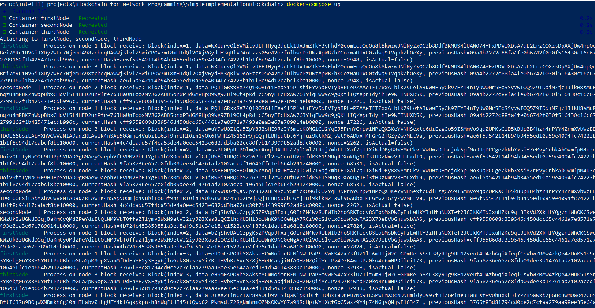

# Simple Implementation Blockchain
Simple Blockchain with sockets

## Build and launch project
You can run my project in Docker.
1) Clone my repository
2) Build and create docker image
3) Push your docker image on Docker Hub in your repository there
4) Launch docker compose

```
git clone https://github.com/Npudov/SimpleImplementationBlockchain.git
docker build -t dockerUsername/simple-implementation-blockchain .
docker push dockerUsername/simple-implementation-blockchain
docker-compose up
```
after docker build -t you can use your docker username account on Docker Hub:
https://hub.docker.com/


## Results
